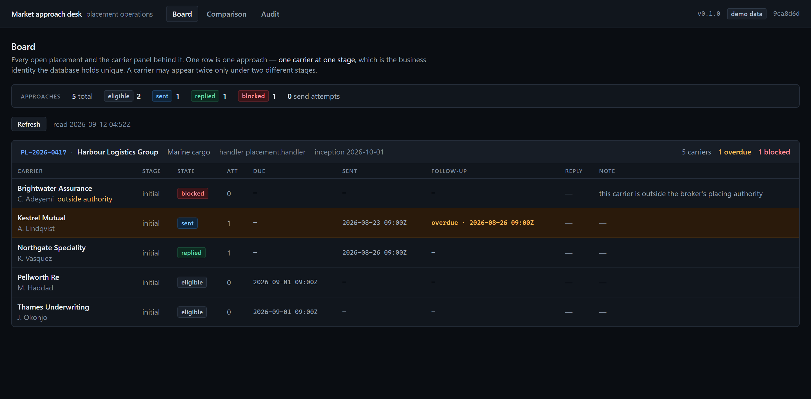
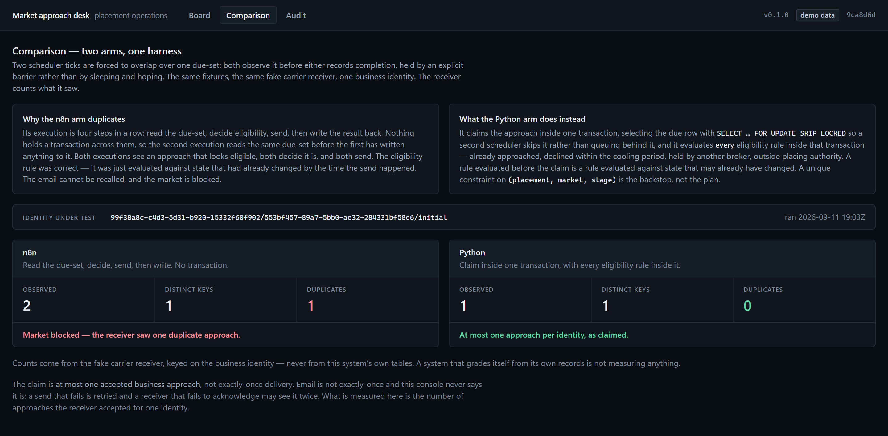
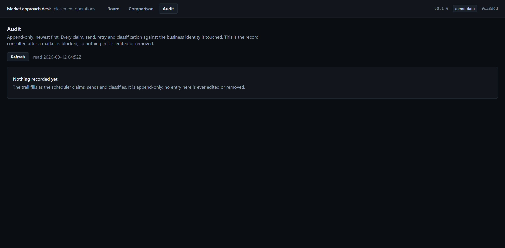

# market-approach-desk

**An insurance broker approaches a panel of carriers to place a risk. Approaching the same carrier
twice for the same risk *blocks the market* — the underwriter declines to re-quote, the account is
deprioritised, and the placement can be lost. There is no retraction: an email that reached an
underwriter has reached them.**

This repository ships **two implementations of the same workflow** — a realistic n8n one and a typed
Python one — against **one fault harness** and **one fake carrier receiver**. The comparison is the
point.

---

## Live demo

**LIVE DEMO: https://market-approach-desk.vercel.app**

**Backend: https://market-approach-desk-api.onrender.com**

| Layer | Service | Plan | Region |
|---|---|---|---|
| Console | Vercel | Hobby | `fra1` |
| API | Render Web Service (Docker) | Free | Frankfurt |
| PostgreSQL | Neon | Free | `eu-central-1` |

Read this before drawing conclusions from what is on the screen:

- **The data is synthetic.** Every placement, carrier, underwriter and reply in the demonstration is
  invented. No real insured, no real carrier and no real broker record appears in this repository or
  in the deployed database.
- **The Python arm is the live service.** What is deployed is the typed Python implementation; it is
  the arm the console reads.
- **n8n is not hosted, and does not need to be.** The workflow is committed at
  [`n8n/market-approach.workflow.json`](n8n/market-approach.workflow.json) and imports into any n8n
  instance; [`n8n/docker-compose.yml`](n8n/docker-compose.yml) runs one locally. Paying to host n8n
  permanently for a portfolio demonstration would buy nothing the committed workflow does not
  already show.
- **The comparison screen renders a measured result, not a typed one.** n8n: **2 observed
  approaches**. Python: **1 observed approach**. Both come from the run that wrote
  [`docs/killtest.json`](docs/killtest.json), and CI re-runs that kill test on every push.
- **No live AI evaluation has been performed.** The shipped package contains no HTTP client and
  cannot reach a model provider — a guard test enforces it. What ships is a deterministic stand-in
  classifier whose `model_id` is `stand-in`.
- **Free tier, so the first request is slow.** The Render instance spins down when idle and a cold
  start delays the first request by roughly 50 seconds; load it once more and it answers normally.
  Neon's free compute also scales to zero and wakes in a second or two.
- **The audit screen is empty on purpose.** The deployment seeds a board, not a history: no
  scheduler execution has run against the deployed database, so there is nothing to record yet.

---

## The measured result

One placement, one carrier, one stage. Two scheduler executions forced to overlap at the moment the
failure lives, and both arms measured at the receiver — never by asking either arm what it thinks it
did.

| Arm | Approaches the carrier observed | Distinct idempotency keys |
|---|---|---|
| **n8n** | **2** | 1 |
| **Python** | **1** | 1 |

Measured on 2026-09-11. Regenerate with `make killtest`; the numbers above are written by the test
that measured them into [`docs/killtest.json`](docs/killtest.json), and CI re-runs it on every push.

**Be precise about what the n8n failure is.** Both of its sends carry the *same* idempotency key, so
a receiver that deduplicated on that header could have collapsed them. An underwriter's mailbox has
no such feature — which is why the receiver does not either, by default. The commercial failure is
real: two emails arrived.

### Why the n8n arm duplicates

The workflow does what a competent automation engineer would build:

```
Schedule Trigger → read due approaches → filter eligible → HTTP send → write state back
```

There is no transaction around those steps and no lock across executions, so a second scheduled
execution reads the due-set while the first is **between its send and its write**. Both see the same
approach as eligible. Both send. That is not an n8n bug — it is what a visual workflow runner does,
and it is invisible until the day two executions overlap.

### What the Python arm does instead

```
claim (ONE transaction: SELECT … FOR UPDATE SKIP LOCKED + every eligibility rule) → commit
   → send → record outcome
```

Two mechanisms, and each covers what the other cannot:

1. **`SELECT … FOR UPDATE SKIP LOCKED`** — a concurrent scheduler does not see a claimed row. It
   skips rather than blocks, so two workers share the queue instead of serialising on it.
2. **Every eligibility rule evaluated *inside* that transaction.** A rule evaluated before the claim
   is a rule evaluated against state that may already have changed — the n8n failure, one layer
   down.

A unique constraint on `(placement_id, market_id, stage)` sits underneath both, and it is worth
being exact about its job: it is a **schema invariant, not a third runtime check**. It guarantees
one row per identity, which is what makes locking that row equivalent to claiming the approach. It
never fires during the race, because nothing but the seeder inserts an approach. A review caught the
first version of this list calling it a third mechanism.

The claim also clears `due_at`, which means the headline kill test alone cannot tell the row lock
from the cleared column — it would pass with `SKIP LOCKED` deleted. So a second test forces two
claim transactions to overlap *before either commits*, where only the lock can decide, and it was
verified to go red when the lock is removed.

**The send is deliberately outside the claim transaction.** Holding a database transaction open
across a network call makes the second scheduler wait instead of skip, which looks safer and quietly
converts two workers into one.

### Why `stage` is in the business identity

A carrier that declined the initial presentation may legitimately be approached again on revised
terms. Keying on `(placement, market)` alone would forbid that — and a tool that forbids legitimate
work gets routed around in a spreadsheet, where nothing is recorded at all.

---

## Where AI is allowed, and where it is forbidden

**Allowed:** classifying an inbound underwriter reply into a closed set —
`interested` · `declined` · `needs_information` · `referred` · `unclear` — with abstention.

**Forbidden, structurally rather than by policy.** The classifier's response type carries no
identifier, no state, no permission flag and no numeric field. A model therefore *cannot express*
"approach this carrier", "this is allowed", or "retry" — so no caller downstream can act on it. A
guard test walks the response schema and fails the build if such a field appears.

The one thing a classification changes: a reply classified `declined` starts a thirty-day cooling
period. That is a rule a person wrote, evaluated inside the claim transaction, applied to a
classification a person can see and correct on the reply itself.

**Live model quality is NOT MEASURED.** The shipped package contains no HTTP client and cannot reach
a provider — a guard test enforces it. What ships is a port plus a deterministic stand-in whose
`model_id` is `stand-in` and whose rationale opens by saying no model produced it.

---

## Run it

```bash
make db-up && make demo    # PostgreSQL, migrations, and the seeded board
make api                   # the API on :8000
make killtest              # THE COMPARISON: both arms, one harness
```

```bash
cd frontend && npm install && npm run dev    # the operator console on :3000
```

The n8n workflow is importable and runnable for real:

```bash
cd n8n && docker compose up -d    # n8n on :5678, then import market-approach.workflow.json
```

---

## What you are looking at

All three screenshots below were captured from the **live deployment** at
<https://market-approach-desk.vercel.app>, not from a local run.

**The board** — every placement and the carrier panel behind it. One row is one approach: one
carrier at one stage, which is the identity the database holds unique.



**The comparison** — the kill-test result, rendered from the run that produced it rather than typed
into a table.



**The audit trail** — append-only. Who approached this carrier, and when.



---

## Honest limits

- **One failure mode is proven; five are analysed.** The portfolio blueprint names six ways the n8n
  arm can fail. This repository demonstrates **overlapping schedule executions** deterministically.
  The other five are analysed in [`n8n/README.md`](n8n/README.md) and are labelled as analysed —
  an analysed failure mode is not evidence.
- **Not exactly-once delivery.** The claim is *at most one accepted business approach per
  `(placement, market, stage)` under the tested contract*, measured at the receiver. Email delivery
  is not exactly-once and this repository never says it is.
- **No live model has been called.** See above.
- **A scheduler that dies between claim and send strands that approach.** The claim commits
  `state = claimed` with `due_at` cleared, and nothing reclaims it — there is no lease and no
  stale-claim sweep. The failure direction is deliberate: the approach is **not sent** rather than
  sent twice, which is the safe side of an irreversible act. Recovery is manual, and the row is
  visible as `claimed` on the board. Found by a review, not by a test.
- **The carrier receiver is in-process.** It stands where an underwriter's mailbox would; there is
  no real mail provider in this repository, so a deployment cannot accidentally acquire one.

---

## Documents

| File | Purpose |
|---|---|
| [`DECISIONS.md`](DECISIONS.md) | ADR-001: the claim and the kill test, **declared before implementation** |
| [`CLAUDE.md`](CLAUDE.md) | the operating rules this repository is built under |
| [`n8n/README.md`](n8n/README.md) | the baseline workflow, and its six failure modes |
| [`PROJECT_STATUS.md`](PROJECT_STATUS.md) | what exists, what is verified, what is not |
